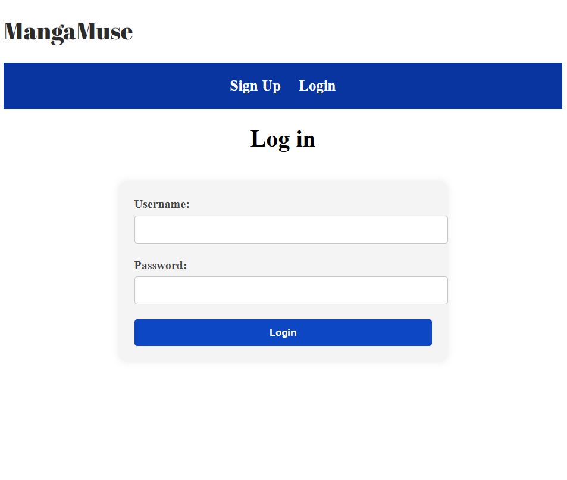

<h1>Project 2: MangaMuse</h1>
<h2>Getting Started</h2>

MangaMuse is an anime review website allowing users to share their anime experiences by creating reviews and viewing reviews from other users. Discover what others think and contribute your own opinions on your favorite shows.

In order to create reviews and view other's profiles.
They must create an account to be able to use the website functionality. These are the different pages that this website has:

 

<b>Sign up:</b> This page allows users create their account for the website.

<b>Login:</b> This page allows users log into their account for the website.

<b>Profile:</b> This page is where the user can view, edit and delete their previously created reviews.

<b>Create:</b> This page is where the user creates an anime review to add to his profile.

<b>Users:</b> This page is where the user can view other users to see their profiles and reviews.

<b>Logout:</b> This is made for users to log out of their currently logged in account.

 

Please share your anime reviews and experience with others in <i><a href="https://mangamuse.onrender.com">MangaMuse</a></i>!

<h2>Attributions</h2>

<b>MongoDB</b>

<ul>
<li><a href="https://github.com/GA-SEB-8/Unit02-Auth-Starter-Template">Authentication Template</li>
<li><a href="https://github.com/GA-SEB-8/Unit02-Week02-Day01-Mongoose-Relationships">Mongoose Relationships</li>
</ul>

<h2>Technologies Used</h2>

<b>EJS:</b> This project uses EJS (Embedded JavaScript) as the templating engine to generate dynamic HTML content on the server side. EJS allows server-rendered views to display real-time data, such as anime details, user reviews, and account-specific features. By embedding JavaScript directly in HTML templates, EJS makes it easy to loop through anime lists, conditionally render elements like "Update" and "Delete" buttons for content owners, and include partial views like a consistent navigation bar across all pages.

<b>CSS:</b> For styling, CSS was used to create a clean and user-friendly interface. Each page is linked to its own stylesheet for better modularity and control. Layouts are styled with modern, responsive containers using flexbox and centered elements. Forms, buttons, image displays, and page sections are all styled to maintain a consistent and accessible look throughout the app.

<b>JavaScript:</b> JavaScript was used primarily on the server side via Node.js and Express to handle routing, form submissions, session management, and database interactions with MongoDB. On the client side, minimal JavaScript was used, as EJS handles most of the dynamic rendering. However, the project is structured to allow easy integration of front-end JS features such as form validation or interactivity in the future.

<b>MongoDB:</b> Is used as the primary database to store and manage all application data, including user accounts, anime reviews, ratings, and associated metadata. Mongoose is used to define schemas and simplify interactions with MongoDB. Each anime entry is linked to the user who created it, enabling features like personalized ownership-based permissions. MongoDB's flexible document-based structure allows for scalable and efficient storage of the app’s growing data set, while Mongoose ensures schema consistency and easy querying.

<h2>Next Steps</h2>

Future enhancements could include creating more customizing to each user's profile. Creating a friend list and adding other users as friends. Adding searching, filtering and sorting in the profile and users pages. 

